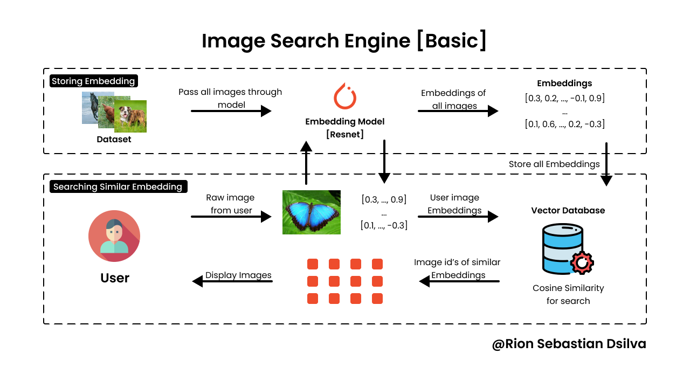

# Image Search Engine using Resnet18 and YOLOv10n

This engine tackles the challenge of finding similar images within a dataset with impressive speed and accuracy. 

Here's what it offers:

**Blazing-Fast Search**: Locate visually similar images in a massive test set (41k images from COCO 2017) with an average search time of just 300ms.

**Deep Learning Powerhouse**: Leverages the power of ResNet-18 for generating image embeddings and YOLOv10n for tagging and indexing.

**Simplified Vector Search**: Similar to a vector database, it utilizes indexing and cosine similarity for efficient searching.

Think of it as a lightweight vector search engine built for image retrieval.

This project demonstrates the power of combining deep learning techniques for feature extraction and efficient indexing methods for fast search.

----
### Follow me

>GitHub [@RionDsilvaCS](https://github.com/RionDsilvaCS)  ·  Linkedin [@Rion Dsilva](https://www.linkedin.com/in/rion-dsilva-043464229/)   ·  Twitter [@Rion_Dsilva_CS](https://twitter.com/rion_dsilva_cs)
